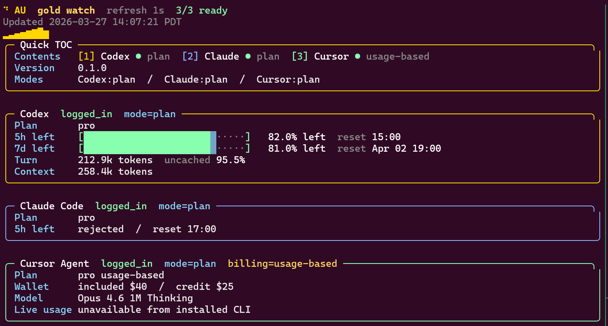

# au

<p align="center">
  
</p>

<p align="center">
  <strong>A tiny usage dashboard for Codex, Claude Code, and Cursor Agent.</strong>
</p>

<p align="center">
  <a href="https://github.com/supdub/au/actions/workflows/ci.yml"></a>
  <a href="https://github.com/supdub/au/blob/main/LICENSE"></a>
  
  
  
</p>

<p align="center">
  <a href="https://supdub.github.io/au/">Project site</a>
  ·
  <a href="CONTRIBUTING.md">Contributing</a>
</p>

`au` inspects local auth state and local usage signals for:

- Codex
- Claude Code
- Cursor Agent

It is designed for two very different jobs:

- JSON-first automation for agent harnesses and scripts
- a colorful live dashboard for humans who want a fast read on plan state

## Table of Contents

- [Why it exists](#why-it-exists)
- [Highlights](#highlights)
- [Quick Start](#quick-start)
- [Showcase](#showcase)
- [What it shows](#what-it-shows)
- [Usage](#usage)
- [Output modes](#output-modes)
- [Install and distribution](#install-and-distribution)
- [CI for PRs](#ci-for-prs)
- [Releases](#releases)
- [Contributing](#contributing)
- [Development](#development)
- [Data sources](#data-sources)
- [Known limits](#known-limits)
- [Roadmap](#roadmap)
- [License](#license)

## Why it exists

Most agent CLIs are good at doing work and bad at answering simple questions like:

- Am I logged in?
- Am I in plan mode or API mode?
- Which environment variable is overriding normal usage expectations?
- How much of the current window is left?
- What does "usage" even mean for this account?

`au` answers those questions from the machine you are already on.

## Highlights

- Compact JSON by default.
- `--watch` dashboard with in-place refresh in the terminal alternate screen.
- btop-inspired boxed panels, tab-style contents strip, and animated header accents.
- Helpful login guidance when a provider is not authenticated.
- Real local Codex token/window parsing.
- Real local Claude session parsing.
- Real local Cursor billing interpretation.
- Packaging scaffolding for zipapp, curl install, Homebrew, and `.deb`.

## Quick Start

### Install the stable release

```bash
curl -fsSL https://raw.githubusercontent.com/supdub/au/main/install.sh | bash
au -v
```

### Track `main`

```bash
python3 -m pip install --upgrade "git+https://github.com/supdub/au.git@main"
au -v
```

### Local development install

```bash
./install.sh --from-local
au -v
```

### Python install

```bash
pip install .
au -v
```

## Showcase

<p align="center">
  
</p>

The watch dashboard is built for always-on terminal use:

- quick top-level contents strip
- boxed btop-style panels
- in-place redraws in the alternate screen
- dense quota-first summaries instead of verbose logs

## What it shows

### Codex

- Detects ChatGPT/Codex login from `~/.codex/auth.json`
- Tells the user to run `codex login` if login is missing
- Marks plan-style usage when login exists
- Flags `OPENAI_API_KEY` when present
- Reads local token totals and plan windows from `~/.codex/sessions/**/*.jsonl`

### Claude Code

- Detects Claude login from `~/.claude/.credentials.json` and `claude auth status`
- Tells the user to run `claude auth login` if login is missing
- Switches to `mode=api` when `ANTHROPIC_API_KEY` is active
- Aggregates latest local session usage from `~/.claude/projects/**/*.jsonl`
- In watch mode, probes Claude's `/insights` stream to surface live rate-limit window state when the installed CLI exposes it

### Cursor Agent

- Detects login from local Cursor Agent auth/config plus `cursor-agent status/about`
- Tells the user to run `cursor-agent login` if login is missing
- Distinguishes `usage_based`, `team`, `individual_plan`, and `unknown`
- Explains what "usage" means only after billing context is known
- Reports live local pricing metadata without inventing usage totals

## Usage

```bash
au
au codex
au claude
au cursor
au -v
au -p
au --verbose
au -w
au -w -i 2
```

### Flags

| Flag | Meaning |
| --- | --- |
| `-w`, `--watch` | Live dashboard mode |
| `-i`, `--interval` | Watch refresh interval in seconds, default `1` |
| `-p`, `--pretty` | Pretty-print JSON |
| `--verbose` | Include detector evidence and raw signals |
| `-v`, `--version` | Print the installed version and a hint for watch mode |

## Output modes

### Default mode: compact JSON

Default output is intentionally compact and token-efficient.

```bash
au claude | jq '.providers[0].usage.metrics.total_tokens'
```

Example shape:

```json
{
  "generated_at": "2026-03-27T19:06:24Z",
  "tool_version": "0.1.1",
  "providers": [
    {
      "id": "codex",
      "auth": "logged_in",
      "mode": "plan"
    }
  ]
}
```

### Watch mode: live terminal dashboard

`au --watch` is optimized for terminal use:

- refreshes in place
- uses the terminal alternate screen
- hides and restores the cursor correctly
- keeps a true 1s steady-state refresh cadence
- caches slower providers so the dashboard remains responsive
- renders bars when the provider exposes trustworthy percentage data
- adds a quick top-level contents strip so each provider is scannable at a glance
- uses rounded panels and animated accents instead of a plain log dump

## Example

```text
au  watch  refresh 1s  3/3 ready
Updated 2026-03-27 12:33:06 PDT

========================================================================================
Codex  logged_in  mode=plan
Plan        pro
5h left     [#####################---]   88.0% left  reset 15:00
7d left     [####################----]   83.0% left  reset Apr 02 19:00
Last turn   33.0k tokens
Uncached    6.8% of last-turn input
```

## Install and distribution

### Zipapp artifact

Build a single-file executable:

```bash
make dist
./dist/au
```

Builder:

- `scripts/build_zipapp.py`
- Stable release artifact: `https://github.com/supdub/au/releases/download/v0.1.1/au`
- Full release page: `https://github.com/supdub/au/releases/tag/v0.1.1`

### Curl installer

`install.sh` is the default install path. It auto-selects the matching macOS/Linux release asset when one is published, validates the Linux native binary on the current host, falls back to the portable Python artifact when the native build is incompatible, and for `latest` can rebuild from the `main` source archive if the published portable artifact is still behind the current compatibility fixes. It then installs:

- `~/.local/bin/au`
- `~/.local/bin/agent-usage` as a compatibility symlink

Default install:

```bash
curl -fsSL https://raw.githubusercontent.com/supdub/au/main/install.sh | bash
```

If you want to pin the currently published release explicitly:

```bash
curl -fsSL https://raw.githubusercontent.com/supdub/au/main/install.sh | AU_VERSION=v0.1.1 bash
```

If you want unreleased changes from `main`, use one of these source-based options instead:

- `python3 -m pip install --upgrade "git+https://github.com/supdub/au.git@main"`
- `https://github.com/supdub/au/archive/refs/heads/main.zip`

Supported environment variables:

- `AU_REPO`
- `AU_VERSION`
- `AGENT_USAGE_VERSION`
- `AU_BIN_DIR`

On Linux, the portable fallback requires `python3` on `PATH`. Current source and portable installs support Python 3.10+.

### Homebrew

Formula scaffold:

- `packaging/homebrew/au.rb`

### Debian / apt-style packages

Build a `.deb`:

```bash
./packaging/debian/build-deb.sh 0.1.1 all
```

## CI for PRs

Pull requests and `main` pushes run GitHub Actions checks from:

- `.github/workflows/ci.yml`

Current CI jobs cover:

- Python setup
- unit tests
- CLI help smoke test
- zipapp build
- Debian package build

## Releases

Tagged pushes matching `v*` run the release workflow at:

- `.github/workflows/release.yml`

Release jobs:

- verify the tag matches `agent_usage_cli.__version__`
- run tests and CLI smoke checks
- publish the portable `dist/au` zipapp, the `.deb`, native binaries for Linux, macOS, and Windows, and `SHA256SUMS` to the GitHub release

## Contributing

Start with:

- `CONTRIBUTING.md`
- `.github/ISSUE_TEMPLATE/`
- `.github/pull_request_template.md`

The public project site is published from `docs/` through `.github/workflows/pages.yml`.

## Development

### Run

```bash
make run
```

### Test

```bash
make test
```

## Project layout

```text
agent_usage_cli/          Python package
au                        local wrapper entrypoint
install.sh                curl-bash installer
scripts/build_zipapp.py   single-file release build
packaging/homebrew/       Homebrew scaffold
packaging/debian/         Debian package builder
tests/                    unit tests
```

## Data sources

### Codex

- `~/.codex/auth.json`
- `~/.codex/config.toml`
- `~/.codex/sessions/**/*.jsonl`

### Claude Code

- `~/.claude/.credentials.json`
- `~/.claude/settings.json`
- `~/.claude/projects/**/*.jsonl`
- `claude auth status`
- `claude -p '/insights' --output-format stream-json --verbose` in watch mode

### Cursor Agent

- `~/.config/cursor/auth.json`
- `~/.cursor/cli-config.json`
- `~/.cursor/statsig-cache.json`
- `cursor-agent status`
- `cursor-agent about`

## Known limits

- `au` is intentionally local-first. It does not pretend to know server-side totals that the installed CLI does not expose.
- Codex currently exposes the plan windows available in local `rate_limits`, but this implementation does not separate Spark vs non-Spark buckets.
- Claude Code currently exposes a live five-hour window reset/state signal on this machine, but not percentage-left fields. `au` will render percentages if the installed Claude CLI starts emitting them.
- Cursor Agent billing meaning is available locally, but current account usage totals are not exposed by the installed CLI/config on this machine.
- If `OPENAI_API_KEY`, `ANTHROPIC_API_KEY`, or `CURSOR_API_KEY` is active, API behavior can diverge from plan-style expectations.

## Roadmap

- Improve Codex bucket breakdown if the local client exposes Spark/non-Spark windows
- Expand Claude window support beyond the current live reset-state probe
- Publish a real Homebrew tap and apt repository metadata

## Icon Credit

- Gold mark in [`assets/au-gold.svg`](assets/au-gold.svg) is derived from Lucide's `coins` icon and used under the Lucide ISC license: <https://github.com/lucide-icons/lucide>

## License

MIT
